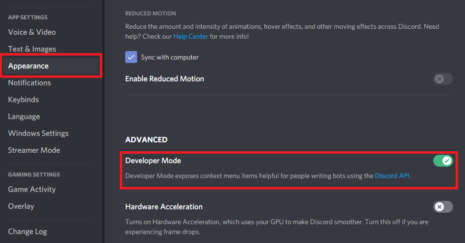

# Discord-Starter-Bot
 
# Discord.js-Starter-Bot
**Disclaimer: this is a bot using the [wokcommands](https://www.npmjs.com/package/wokcommands) npm package from [Worn Off Keys](https://www.youtube.com/channel/UChPrh75CmPP9Ig6jISPnfNA) to make this bot, you can join his [Discord Server](wornoffkeys.com/discord). If you are new to Discord.js and JavaScript in general, then you will have some difficulties setting up this bot. To undertand what is happening you need a decent basic knoledge about Javascrip and how Disocrd bots work in general. This bot already has some commands and features. If you have any question DM on Discord: Yuuki#0220**

## Installation
This bot is using various npm packages, you need to download them to be able to use the bot. It is also using a MongoDB database and it is heavily recommended to create one to avoid any problem.

### NPM Packages

Type `npm i` to download all the bot's packages.

### Configuration

### How to add commands

As I said before, this code is using the [wokcommands](https://www.npmjs.com/package/wokcommands) package so to create a command, go to the "commands" folder and inside there you can create all you commands with the following structure:

```js
module.exports = {
    ownerOnly: true, // Owner only command (Boolean) - Optional
    guildOnly: true, // Guild only command (Boolean) - Optional
    testOnly: true, // Test servers only command (Boolean) - Optional

    name: 'ping', // Name of the command (String)- Optional
    commands: ['runping'], // Execute name of the command (String/Array)- Optional
    aliases: ['p'], // Aliases of the command (String/Array) - Optional
    description: 'Replies with pong', // Description of the command (String)

    requiredPermissions: ['ADMINISTRATOR'], // User's required permissions to run the command (Array) - Optional
    cooldown: '5s', // Per user cooldown of the command (s-seconds m-minutes h-hours) - Optional
    //globalCooldown: '60s', // Per server cooldown of the command (minimum 60s) - Optional
    category: 'Misc', // Category of the command (String)

    minArgs: 0, // Minimun arguments of the command - Optional
    maxArgs: 0, // Maxmimum arguments of the command (Infinite  = -1) - Optional
    
    syntaxError: 'Incorrect syntax! Use `{PREFIX}ping`', // Syntax Error of the command - Optional
    expectedArgs: "<Target user's @>", //Expected arguments of the command - Optional (reccommended)
    
    callback: async ({  message, args, text, client, prefix, instance }) => {
      message.reply('pong')
    }
  }
```
Read the [wokcommands](https://www.npmjs.com/package/wokcommands) full documentation for more detailed information.

### How to add features

You need to go to the "features" folder and inside that folder you can create all of your events following the structure:
```js
module.exports = (client, instance) => {
  console.log('Hello world!')
}

module.exports.config = { // Optional
  displayName: 'Test', // Can be changed any time
  dbName: 'TEST', // Should be unique and NEVER be changed once set
  loadDBFirst: true, // Wait for the database connection to be present
}
```
Read the [wokcommands](https://www.npmjs.com/package/wokcommands) full documentation for more detailed information.

### Index.js Configuration

#### How to make yourself the bot owner

To be the bot owner you need your discord ID, to get it go to your discord settings and on the appereance tab activate developer mode.


After activating developermode copy your ID by rightclicking your user and clicking on "Copy ID".


Then go to your `index.js` file and paste your id on the `.setBotOwner` brackets.
```
.setBotOwner([' '])
```

### How to add a Test Server

Copy your discord test server id and go to the index.js file and paste that id on the `testServers: [''],` brackets.

```js 
new WOKCommands(client, {
    commandsDir: 'commands',
    featureDir: 'features',
    messagesPath: 'messages.json',
    showWarns: true,
    testServers: [''], // <--
})
```

## Credits
Thanks to [Worn Off Keys](https://www.youtube.com/channel/UChPrh75CmPP9Ig6jISPnfNA) for teaching me how to code and making it open source to make it easier to code. Full credits to [https://waifu.pics](https://waifu.pics) letting me use their API.

## License
[MIT](https://github.com/rene-roid/Discord-Starter-Bot/blob/main/LICENSE)